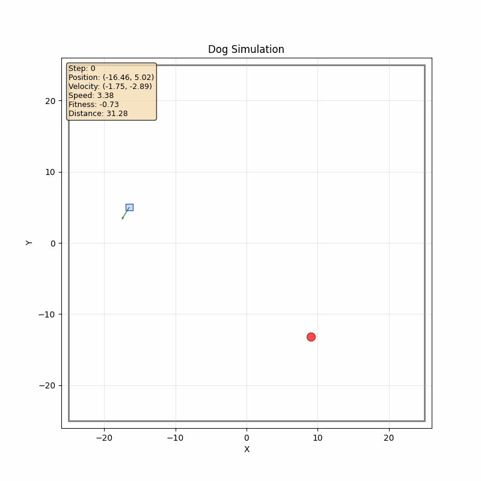
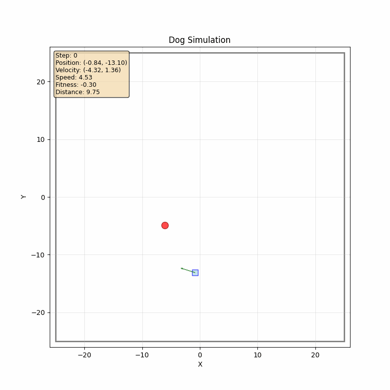
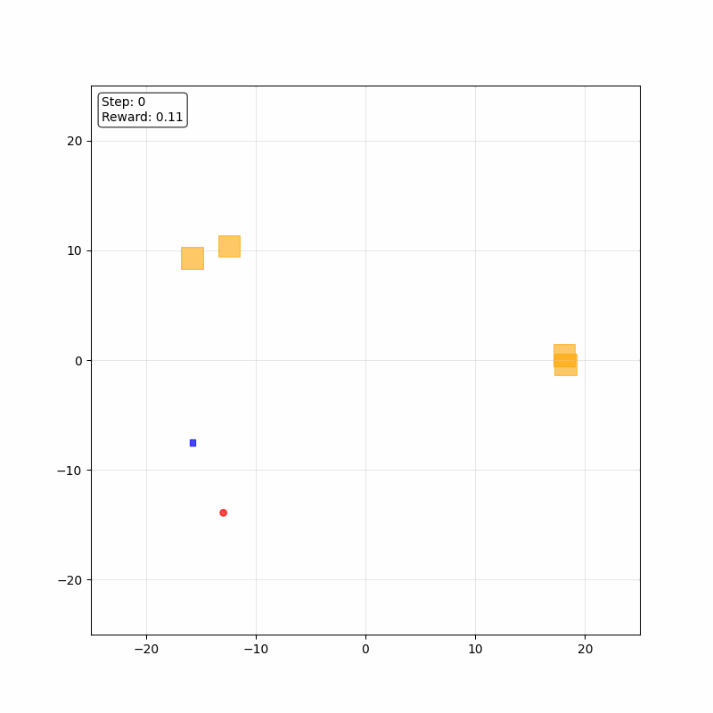
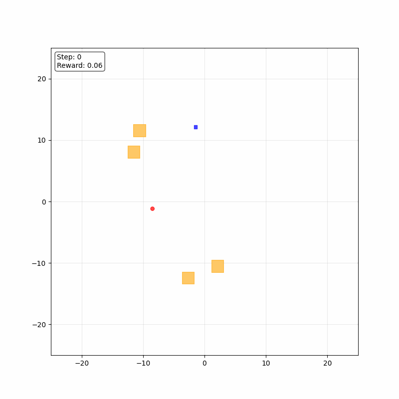

<h3>Лучшее решение первой симуляции</h3>

hiden_dim = 512

<table align="center">
  <tr>
    <td align="center">
       
      <small>1600 эпоха</small>
    </td>
    <td align="center">
       
      <small>1700 эпоха</small>
    </td>
    <td align="center">
       
      <small>1800 эпоха</small>
    </td>
  </tr>
</table>

<h3>Лучшее решение второй симуляции</h3>

hiden_dim = 256

<table align="center">
  <tr>
    <td align="center">
       
      <small>9800 эпоха</small>
    </td>
    <td align="center">
       
      <small>9900 эпоха</small>
    </td>
    <td align="center">
       
      <small>10000 эпоха</small>
    </td>
  </tr>
</table>

!!!Важно для работы с cuda надо установить саму cuda а также pytorch с потдержкой cuda.!!!

***Simulation***

Class Dog - просто класс на который воздействует Enviroment, хранит состояние собаки (position, velocity, acceleration) это все torch.tensor(size=2, dtype=float), также хранит (angle, angle_velocity, angle_acceleration) torch.tensor(size=1, dtype=float) angle хранится в формате (-pi, pi]

Class Enviroment - сама симуляция, хранит в себе все данные среды (пока это поле и цель собаки).
-  step производит изменение характеристик собаки и обновляет цель, тик системы (если добавлять блоки логики, то надо выносить их реализацию из функцию).
-  reset возвращает собаку с начальным состоянием и рандомную цель (в будующем надо сюда заносить обнуление всех вспомогательных систем).
-  get_state принимает dog и target и возвращает входной вектор нейроной сети.
-  create_target возвращает стандртную цель с рандомным положением.
-  self.stats пока неиспользуемый словарь в нем можно хранить все вспомогательные параметры системы.

***Evolution***

Class EvolutionaryNetwork - простая нейронка (напрямую с ней почти не работаем).  
Class Individual - структурная единица в алгоритме эволюции (обертка EvolutionaryNetwork).
-  evaluate - возвращает среднее значение fitness(reward) за несколько эпизодов.
-  predict - принимает state возвращает accelerate, angle_acceleration (используем его вместо individual.network.forward() так как обрабатывает входной state).
-  _run_episode - проводит один эпизод, возвращает fitness.
-  mutate - возвращает нового individual с частично измененными весами.
-  crossover - возвращает нового individual который состоит из весов обоих родителей (пока просто выбирается половина весов у одного родителя а другая половина у второго родителя).

Class Species - класс для объединения похожих individuals что-бы crossover происходил между похожими индивидами.

Class EvolutionaryAlgorithm - класс который отвечает за сам эволюционных процесс, объединяет индивидуумов в species и производит отбор лучших моделей.
-  run - главная функция алгоритма, производит оценку индивидов, естоственный отбор и видообразование.

***Visualizer***

Просто визуализация на matplotlib. 
Есть функция animation(individual, env, interval_animation=10, device="cpu") запускает одиночный прогон на 200 шагов.

***BasicTrain***

Классическое обучение с учителем для предобучения моделей. Создана простая логика следования к целям, и на ней обучены модели для первой эпохи эволюционного алгоритма (для решения проблеммы холодного старта).
